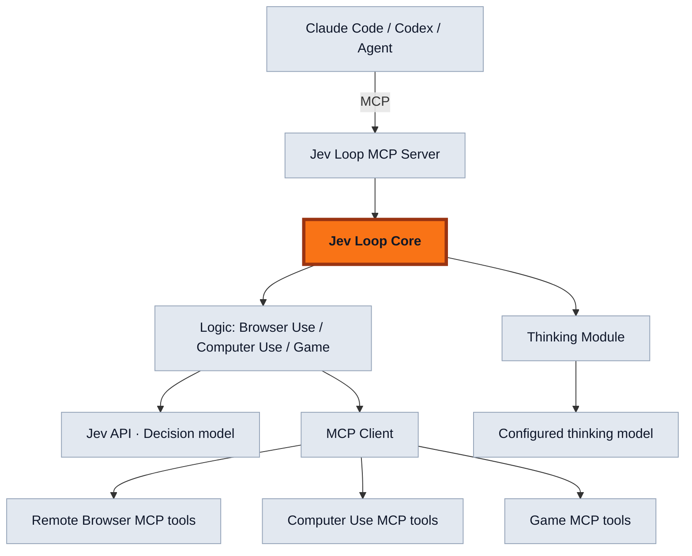

# jev-loop-mcp for agents

Jev Loop owns automation decisions. Agents submit a goal through MCP; task-specific Logic observes state, chooses actions with Jev, requests Thinking when needed, and decides when to continue or hand control back. It is not a conversational orchestrator.

## Stack



- **Core:** serial iteration, cancellation, timeouts and Thinking call budgets.
- **Logic:** task-specific decisions. Browser Use and Computer Use ship here; Game remains a future implementation.
- **Jev API:** evaluates action/target candidates supplied by Logic. It is not the MCP transport.
- **Thinking Module:** shared assistance, invoked through `LoopContext.think()`. The host configures the model/provider; Logic describes the problem and validates the result.
- **MCP Client:** sends observation/action calls to tools. Hosts can inject an authenticated connection so credentials, authorization and durable pre-mutation checkpoints remain host-owned.
- **Remote tools:** expose structured state, stable targets, revisions, scoped actions and inspectable operation IDs. They do not own the decision loop or model credentials.

An extra adapter package is not required. Different MCP tool contracts may need mapping, but merely speaking MCP does not guarantee compatibility with a particular Logic. Browser Use currently implements a defined browser tool protocol; it does not automatically understand arbitrary browser servers or websites.

## Browser Use

Import `@0xmaxma/jev-loop/browser-use`. `runBrowserUse(input, dependencies, signal)` owns browser-specific observation normalization, Jev action-space construction, target selection, field requests, stale recovery, limits and completion handoff. `mcpBrowserTransport(invoke)` translates MCP content envelopes. There are no website-specific scripts.

Dependencies provide authenticated MCP calls, Jev evaluation, host-configured Thinking for field values, progress, and optional independent verification. Missing text yields a field handoff; an unverified completion candidate is never reported as success. Mutations require scoped browser leases and unique operation IDs. Unknown outcomes are not replayed. Hosts persist and reconcile receipts across process restart.

Remote Browser installs no separate runner/adapter package: its server/extension provide tools, while this repository owns the browser decision implementation and unit tests.

## MCP hosting

Install the package and configure the agent's MCP client:

```json
{
  "mcpServers": {
    "jev-loop": {
      "command": "jev-loop-mcp",
      "args": ["--config", "/absolute/path/jev-host.mjs"]
    }
  }
}
```

The trusted operator module exports an async factory returning `{logics, authorize, timeoutMs?}`. A registered Logic has `id`, `inputSchema`, `parse(input)`, and `run(input, {signal, check})`. For Browser Use, the factory wraps the exported `runBrowserUse` with its host-configured connections and provider callbacks. Never accept module paths, credentials or executable code from tool arguments. `parse` validates inputs and Logic checks scope/cancellation before actions.

Agents discover `jev_run` and call `{logic, input}`. It returns a bounded JSON result, stays open for at most ten minutes, and supports MCP cancellation. This is not a standalone durable background-job server: task ownership, checkpointing and restart reconciliation belong to the host. A non-cooperative cancelled execution blocks another run on the same server until it settles.

`createLoopServer` from `@0xmaxma/jev-loop/mcp` supports embedded SDK transports as well as stdio. Use one instance per authenticated principal/conversation. Network exposure needs explicit host authentication; the CLI does not expose an unauthenticated HTTP listener.

## Core and Thinking API

`runLoop` accepts `observe`, `decide`, and `execute`; decisions return `{action}` or `{result}`, execution returns a terminal result or undefined to observe again. This is the internal execution contract used by task-specific Logic.

Pass `thinking(request, signal)` to Core. Logic requests assistance with `context.think(request)`; Core bounds calls with `maxThinkingCalls` (default 60) and `thinkingTimeoutMs` (default 15 seconds), and rejects late results after cancellation.

`thinkJson` from `@0xmaxma/jev-loop/thinking` implements tool-free OpenAI-chat or Anthropic-messages JSON assistance. Hosts provide endpoints/models/credentials and consent policy. Logic validates returned JSON for the task. Available usage is returned, not estimated billing. This module does not persist credentials or page contents.

`toolRegistry` optionally provides parsed tool inputs, authorization and mandatory host checkpoints for mutations. Logic with equivalent protocol guards can use them directly.

## Development and verification

Node 22+. Run `npm ci`, `npm run build`, and `npm test`. Browser source is in `logic/browser-use.ts`; compiled JS/declarations are committed for immutable archive installs without install scripts. Core/MCP tests and Browser Use unit tests live here. Remote tool/extension integration tests live with the MCP server implementation.

Tests cover cancellation, budgets, input validation, scoped actions, uncertain mutations, Thinking, independent stdio clients and browser decisions. Synthetic fixtures do not prove real-site success or latency. Never replay an uncertain mutation as crash recovery.

Browser Use retries `STALE_OBSERVATION` from read-only observations within the consecutive stale-recovery budget, including initial navigation and post-action reads. A confirmed navigation/click is never repeated to recover its observation. Persistent stale reads stop as `STALE_RETRY_BUDGET`; consent and other errors are not retried by this path.

### Dense browser observations

Browser Use may act on an observed, supported control even when the observation
omits other elements. Each mutation still validates the current generation and
actual node; omitted elements never become invented targets. Search/filter inputs
and scrolling can narrow the next observation. A truncated viewport (including
older observations without viewport completeness metadata) cannot establish DONE:
it returns a verification candidate for the supervising agent to inspect. There is
no automatic replay of unknown mutations or unbounded retry.

## Computer Use

Import `@0xmaxma/jev-loop/computer-use` and call `runComputerUse`. This logic uses
structured application/control observations from an MCP computer tool server; it
never assumes screenshots can be sent directly to Jev. The host supplies Jev,
Thinking, authorization and a durable `beforeMutation` callback. The tool contract
is `computer_acquire`, `computer_observe`, `computer_action`,
`computer_operation_status`, `computer_release`. Controls support observed press
and text replacement; approved app IDs support open; navigation keys are bounded.
Computer Use is platform-independent at this boundary; OS accessibility adapters
belong in the tool server.

`latestGoal()` returns a complete goal and monotonically increasing revision.
Revisions are checked after evaluation and Thinking, and before dispatch. Obsolete
decisions are discarded. A new goal does not replay an action already sent to the
OS. Authorization and cancellation are checked before each action. Unknown outcomes
return `needs_reconciliation`; partial observations do not prove completion.

## Background MCP tasks and live instructions

`createTaskServer` from `@0xmaxma/jev-loop/tasks` exposes `jev_start`, `jev_update`,
`jev_status`, `jev_stop`. It is an optional host-side task facility, separate from
the bounded foreground `jev_run` server. The operator supplies an absolute private
storage directory, a trusted authenticated scope, authorization and a `run` callback.
Never obtain the scope or directory from model tool arguments. Use the Gateway's
existing task service when embedding into Gateway rather than adding a competing queue.

Start returns an accepted task ID. Update requires the expected revision and full
revised goal, and only changes the same active task. Stop interrupts future actions.
State and pre-mutation checkpoints are durably recorded. Host restart marks unfinished
work `needs_reconciliation`, blocks new jobs in that scope, and does not replay it.
Only one host process can own a scope at once. The physical-device MCP server must
also enforce exclusivity across all scopes. Unknown outcomes require explicit
host/operator reconciliation; this module does not infer that it is safe to clear them.

### Breaking API rename

The canonical web logic is **Browser Use**, shared by compatible local and remote
browser MCP servers. Import `/browser-use`, `runBrowserUse` and
`BROWSER_USE_CONTRACT_VERSION`. The old `/browser` export and `runBrowserTask`
name are removed, with no aliases. Deploy matching consumers and package versions
together. Computer Use uses `/computer-use` and `runComputerUse`.

### Desktop observation evidence

Computer Use observations include a bounded `windowTitle` and `text` list from accessibility static text/heading nodes, in addition to interactive controls. These fields remain untrusted app content and reach both decisions and independent verification. `NO_SUPPORTED_ACTION` means the decision engine chose no supported next step; it is not a provider or account refusal. A partial observation still cannot prove goal completion.

## Basic execution and trace (0.4)

Browser and Computer Use decide from the authorized goal, current observations
and supported actions. Experience packs, learning stores, registry downloads,
training APIs and their package exports have been removed. Upgrade consumers
with this version; remove the obsolete `gateway.jev.experience` configuration
before upgrading Gateway. Existing private cache files are inert and are not
read or automatically deleted.

Browser Use retains up to ten recent actions in memory, including the observed
target, entered value and confirmed/not-executed/unknown outcome. This context
reaches the authorized decision and field-value inference providers, not the
persisted structural trace. Field labels normalize whitespace and Unicode, but
ambiguous labels still require a handoff. Missing values are not invented.

`maxStaleRetries` bounds consecutive recovery attempts. Actual observed progress
resets that counter; total retries remain visible in the result. Evaluation,
action and time budgets still cap the task. Rejected stale decisions are discarded;
uncertain mutations are never retried. `NO_SUPPORTED_ACTION` means the chooser
could not select a supported next step, not that the website blocked automation.

An optional synchronous `trace(event)` host callback and the final result's
`trace` expose ordered structural events: decisions, dispatch, action outcome,
observed effect, field resolution, recovery and terminal verification. Events
carry request/operation IDs for host correlation, but no page text, target labels,
URLs or entered values. Confirmed dispatch is distinct from observed effect and
independently verified whole-goal success. A missing effect is not proof of failure.
Traces cap at 1024 events; `truncated` and `sinkFailed` explicitly flag limitations.
Hosts persist traces privately under task authorization; they must still use the
transport's durable pre-mutation checkpoint for crash safety. Telemetry is not an
execution fence. No trace is uploaded and no experience registry is contacted.

Real-site acceptance still requires a consented browser and independently checked
results. Unit fixtures alone do not establish Google Flights success or latency.

### Computer Use diagnostics and focus

Computer observations report keyboard focus. Typing focuses its target; submitting
a search/form remains a separate Jev-selected action, never a hardcoded Enter.
Each loop round emits structural progress: observation, evaluation, decision,
Thinking, dispatch, action result and observed change. `progress(event)` provides
live events and the result contains a bounded trace (up to 2000 events). It includes
round/request/operation IDs, selected action, key, role, confidence and durations,
not typed values or app text. Hosts can persist the trace per authorized request.
Dispatch completion alone does not prove that the UI changed or the goal is met.

The last eight observed action effects inform the next Jev choice only within the
current goal. An action that twice produced no observed change on the same state
is withheld until the state changes, while other actions remain available. This
is execution feedback, not an Experience Pack or persistent learning.

Computer live control uses a separate `interruptSignal`: decisions, Thinking and
verification can stop promptly, while an already dispatched mutation retains its
normal execution signal until its receipt arrives. An interrupted pre-dispatch
checkpoint emits `acted/not_executed`; `acting` is never proof of execution. Hosts
must retain their durable operation fence until `acted` reports `completed` or
`not_executed`, and must preserve unknown outcomes for reconciliation. Trace sink
failures do not turn known action outcomes into retries.
