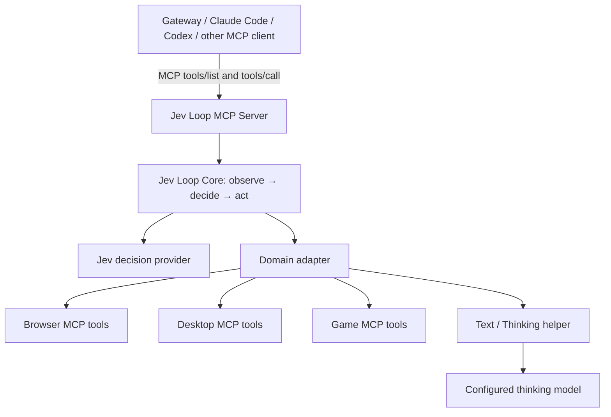

# jev-loop-mcp for agents

Give an agent a goal-driven automation loop through MCP. Jev Loop is a reusable execution core with domain adapters, not a replacement for the conversational agent. Agents remain responsible for user intent, permissions and decisions that require human input.

## Stack



**MCP transports calls; adapters supply domain meaning.** A browser adapter maps observations into decision candidates, resolves action targets, checks freshness, handles leases and records mutation receipts. A desktop or game adapter implements its own equivalent semantics. Existing MCP servers do not need modifications if an adapter can wrap their tools. Arbitrary MCP tools are not automatically safe or effective automation adapters.

- **Agent/host:** configures providers and secrets, grants scope, owns tasks and durable receipts, and resolves genuine blockers.
- **MCP server:** exposes `jev_run`, selects only operator-installed adapters, bounds execution and propagates cancellation. One instance belongs to one authenticated principal/conversation.
- **Core:** runs serial observe/decide/execute with budgets and cancellation, without product-specific rules.
- **Domain adapter:** translates domain tools, enforces scope and freshness, supplies recovery and completion evidence. It must check cancellation/authorization immediately before every side effect.
- **Thinking module:** handles bounded JSON subproblems such as text generation. Provider keys stay in trusted host configuration, never tool arguments.

For Remote Browser, the adapter package can retain its existing runner package name for compatibility; it delegates iteration to Core. The extension supplies observation/action capabilities. Core and model credentials are not installed in the extension.

## Run as an MCP server

Install this package and a domain adapter. Configure your MCP client to launch:

```json
{
  "mcpServers": {
    "jev-loop": {
      "command": "jev-loop-mcp",
      "args": ["--config", "/absolute/path/jev-host.mjs"]
    }
  }
}
```

`jev-host.mjs` is **trusted operator code**, exporting an async factory returning `{adapters, authorize, timeoutMs?}`. Adapter modules/provider credentials are configured here, never loaded from model-supplied paths. Each adapter provides `id`, an `inputSchema` describing its domain arguments for agent discovery, `parse(input)` and `run(input, {signal, check})`. `parse` must validate its domain input; `run` uses Core and checks `check()` before actions. Only install code you trust. The server is stdio by default; network exposure requires host authentication and a separate server per principal/scope.

Agents discover `jev_run` and call it with `{adapter, input}`. It returns the adapter's JSON result. The call stays open for bounded execution (maximum ten minutes); clients must configure their request timeout accordingly and can cancel through MCP. This version does **not** advertise durable background jobs or restart/resume: hosts own that lifecycle and must inspect receipts after interruption. The MCP server never automatically replays a request. A non-cooperative cancelled adapter blocks further runs on that server until it settles.

`createLoopServer` from `@0xmaxma/jev-loop/mcp` also supports an embedded MCP transport. This lets a host pass trusted inference/checkpoint callbacks to adapters without exposing a callback HTTP endpoint or serializing secrets. Embedded and stdio hosting expose the same MCP tool contract.

## Core API

```js
const { runLoop } = require('@0xmaxma/jev-loop');
const result = await runLoop({
  signal: abortController.signal,
  maxCycles: 60,
  observe: async ctx => device.observe(ctx.signal),
  decide: async (state, ctx) => chooser.choose(goal, state, ctx.signal),
  execute: async (action, ctx) => device.execute(action, ctx.signal),
});
```

Decisions return `{action}` or `{result}`. Execution returns a terminal result or undefined to observe again. Core bounds stage calls; adapters own freshness, scope, leases, receipts and independent completion verification. Restarting a loop alone is not durable resume. A timed-out tool may still have an external side effect if it ignores cancellation: record and reconcile that uncertainty before further execution.

`toolRegistry` validates tool identity, parses inputs, checks authorization, and requires a host checkpoint before mutating tools. It rechecks authorization after checkpointing. Adapters with stronger native guards can implement these checks directly.

`thinkJson` from `@0xmaxma/jev-loop/thinking` supports OpenAI chat and Anthropic messages APIs. Hosts supply endpoint/model/credential per invocation and a bounded signal. Input, output and output tokens are bounded; callers validate returned JSON against their operation-specific schema. It returns available usage, not estimated billing. Hosts apply consent/data-sharing policy before submitting observations. The library does not log or persist credentials or page data.

## Verification and scope

Node 22+. `npm test` checks domain-independent iteration, budgets, cancellation, mutation fencing, authorization, Thinking responses and actual MCP client/server calls. Consumers pin immutable commit archives until an npm release is published. Tests with simulated domains do not establish success or latency on real websites. Browser/Desktop/Game in the diagram describe adapter roles, not a claim that all three production adapters ship in this package.
